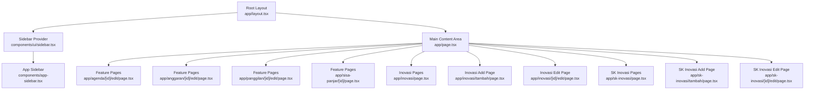
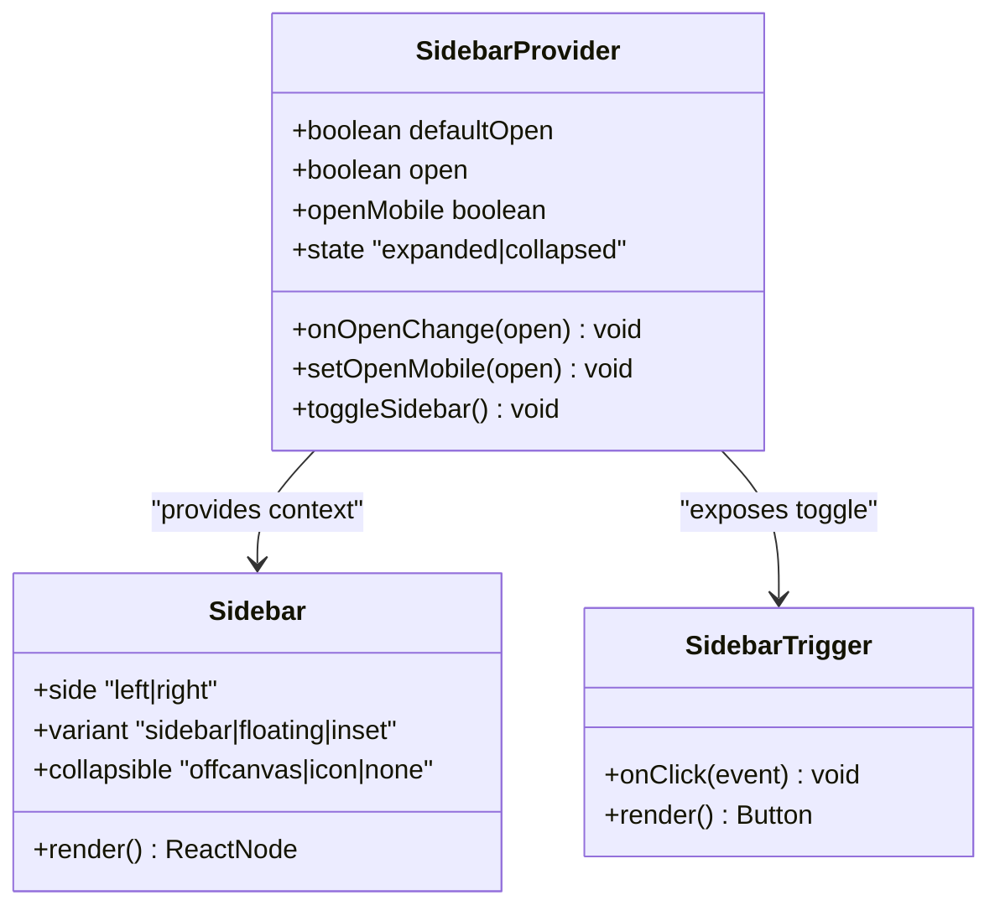
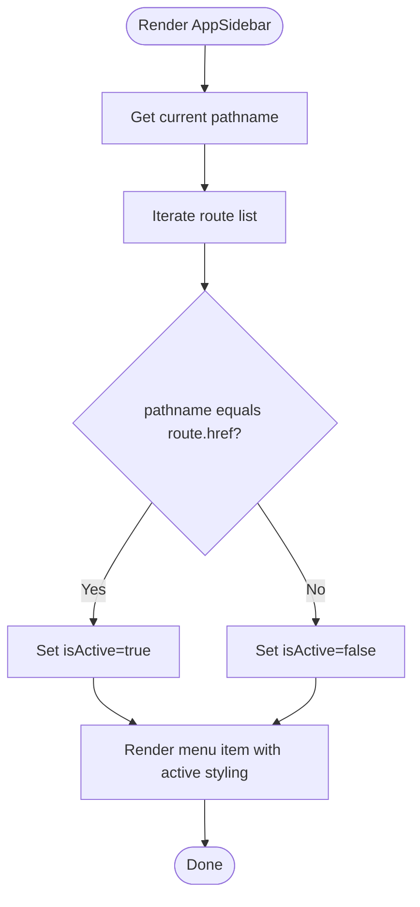
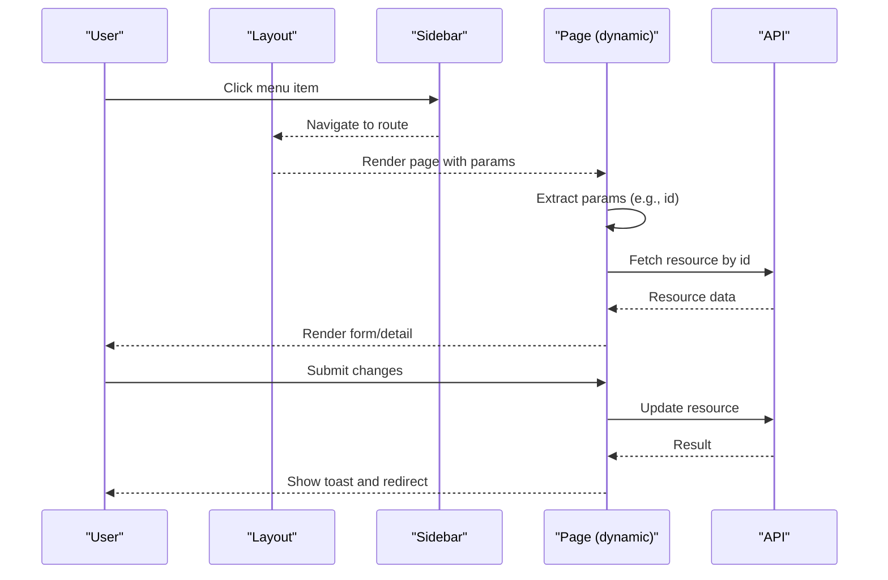
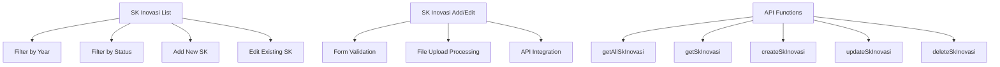
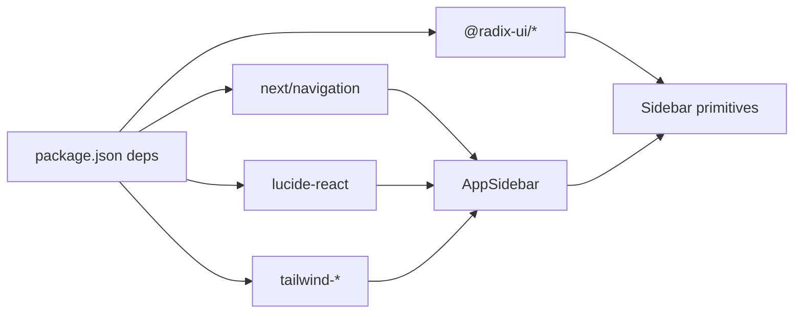

# Navigation and Routing

<cite>
**Referenced Files in This Document**
- [layout.tsx](file://app/layout.tsx)
- [app-sidebar.tsx](file://components/app-sidebar.tsx)
- [sidebar.tsx](file://components/ui/sidebar.tsx)
- [use-mobile.tsx](file://hooks/use-mobile.tsx)
- [page.tsx](file://app/page.tsx)
- [agenda/[id]/edit/page.tsx](file://app/agenda/[id]/edit/page.tsx)
- [anggaran/[id]/edit/page.tsx](file://app/anggaran/[id]/edit/page.tsx)
- [panggilan/[id]/edit/page.tsx](file://app/panggilan/[id]/edit/page.tsx)
- [sisa-panjar/[id]/page.tsx](file://app/sisa-panjar/[id]/page.tsx)
- [inovasi/page.tsx](file://app/inovasi/page.tsx)
- [inovasi/tambah/page.tsx](file://app/inovasi/tambah/page.tsx)
- [inovasi/[id]/edit/page.tsx](file://app/inovasi/[id]/edit/page.tsx)
- [sk-inovasi/page.tsx](file://app/sk-inovasi/page.tsx)
- [sk-inovasi/tambah/page.tsx](file://app/sk-inovasi/tambah/page.tsx)
- [sk-inovasi/[id]/edit/page.tsx](file://app/sk-inovasi/[id]/edit/page.tsx)
- [api.ts](file://lib/api.ts)
- [utils.ts](file://lib/utils.ts)
- [use-toast.ts](file://hooks/use-toast.ts)
- [globals.css](file://app/globals.css)
- [package.json](file://package.json)
</cite>

## Update Summary
**Changes Made**
- Added new 'SK Inovasi' navigation item with FileText icon in the sidebar
- Updated route configuration patterns to include comprehensive SK Inovasi CRUD functionality
- Enhanced dynamic routing documentation with new SK Inovasi management features
- Added comprehensive examples of SK Inovasi page implementation with file upload capabilities
- Updated sidebar navigation patterns to include the new SK Inovasi section alongside existing administrative sections

## Table of Contents
1. [Introduction](#introduction)
2. [Project Structure](#project-structure)
3. [Core Components](#core-components)
4. [Architecture Overview](#architecture-overview)
5. [Detailed Component Analysis](#detailed-component-analysis)
6. [Dependency Analysis](#dependency-analysis)
7. [Performance Considerations](#performance-considerations)
8. [Troubleshooting Guide](#troubleshooting-guide)
9. [Conclusion](#conclusion)
10. [Appendices](#appendices)

## Introduction
This document explains the navigation and routing architecture of the Next.js admin panel. It covers the file-based routing model, dynamic routing with parameters, the sidebar navigation system, active state management, responsive behavior, route configuration patterns, navigation state management, and mobile responsiveness. It also provides examples of route creation, parameter handling, and navigation patterns, along with guidance on breadcrumbs, accessibility, and troubleshooting.

**Updated** Added comprehensive coverage of the new SK Inovasi navigation system with complete CRUD functionality and FileText icon integration, seamlessly positioned alongside existing administrative sections.

## Project Structure
The application follows Next.js App Router conventions with file-based routing under the app directory. Each feature module is organized as a folder with optional nested dynamic segments (for example, /[id]/edit). The root layout composes the sidebar and page content area. UI primitives for the sidebar are encapsulated in a reusable component.

**Diagram sources**
- [layout.tsx:12-36](file://app/layout.tsx#L12-L36)
- [sidebar.tsx:56-162](file://components/ui/sidebar.tsx#L56-L162)
- [app-sidebar.tsx:137-231](file://components/app-sidebar.tsx#L137-L231)
- [page.tsx:10-237](file://app/page.tsx#L10-L237)
- [agenda/[id]/edit/page.tsx](file://app/agenda/[id]/edit/page.tsx#L17-L153)
- [anggaran/[id]/edit/page.tsx](file://app/anggaran/[id]/edit/page.tsx#L29-L154)
- [panggilan/[id]/edit/page.tsx](file://app/panggilan/[id]/edit/page.tsx#L19-L339)
- [sisa-panjar/[id]/page.tsx](file://app/sisa-panjar/[id]/page.tsx#L28-L303)
- [inovasi/page.tsx:1-339](file://app/inovasi/page.tsx#L1-L339)
- [inovasi/tambah/page.tsx:1-180](file://app/inovasi/tambah/page.tsx#L1-L180)
- [inovasi/[id]/edit/page.tsx](file://app/inovasi/[id]/edit/page.tsx#L1-L204)
- [sk-inovasi/page.tsx:1-214](file://app/sk-inovasi/page.tsx#L1-L214)
- [sk-inovasi/tambah/page.tsx:1-191](file://app/sk-inovasi/tambah/page.tsx#L1-L191)
- [sk-inovasi/[id]/edit/page.tsx](file://app/sk-inovasi/[id]/edit/page.tsx#L1-L227)

**Section sources**
- [layout.tsx:12-36](file://app/layout.tsx#L12-L36)
- [sidebar.tsx:56-162](file://components/ui/sidebar.tsx#L56-L162)
- [app-sidebar.tsx:137-231](file://components/app-sidebar.tsx#L137-L231)
- [page.tsx:10-237](file://app/page.tsx#L10-L237)

## Core Components
- Root layout: Provides the global shell, sidebar provider, and main content container.
- Sidebar provider and primitives: Manage responsive sidebar behavior, keyboard shortcuts, cookies, and state.
- App sidebar: Renders the navigation menu, computes active state from the current path, and integrates with the sidebar primitives.
- Feature pages: Demonstrate dynamic routing with parameters, parameter extraction, and navigation back to lists.
- **Updated** SK Inovasi pages: Complete CRUD functionality for SK management with file upload capabilities and status management.

Key responsibilities:
- File-based routing: Next.js resolves routes from the app directory structure.
- Dynamic routing: Segments like [id] capture identifiers for edit pages.
- Active state: The sidebar highlights the current route using the pathname hook.
- Responsive behavior: Mobile detection toggles between overlay and collapsed modes.
- **Updated** SK management: Comprehensive CRUD operations with status filtering, file URL management, and pagination.

**Section sources**
- [layout.tsx:12-36](file://app/layout.tsx#L12-L36)
- [sidebar.tsx:56-162](file://components/ui/sidebar.tsx#L56-L162)
- [app-sidebar.tsx:137-231](file://components/app-sidebar.tsx#L137-L231)
- [sk-inovasi/page.tsx:1-214](file://app/sk-inovasi/page.tsx#L1-L214)
- [sk-inovasi/tambah/page.tsx:1-191](file://app/sk-inovasi/tambah/page.tsx#L1-L191)
- [sk-inovasi/[id]/edit/page.tsx](file://app/sk-inovasi/[id]/edit/page.tsx#L1-L227)

## Architecture Overview
The navigation stack combines Next.js file-based routing with a custom sidebar component built on Radix UI primitives. The sidebar provider manages state and exposes a toggle mechanism. The app sidebar reads the current path and marks active menu items. Feature pages use dynamic segments to load and edit records by ID.

**Updated** The architecture now includes comprehensive SK Inovasi management with file upload capabilities, status management, and advanced filtering.

```mermaid
graph TB
subgraph "Runtime"
R["Next.js App Router"]
H["usePathname()<br/>next/navigation"]
U["useIsMobile()<br/>hooks/use-mobile.tsx"]
end
subgraph "UI Layer"
SP["SidebarProvider<br/>components/ui/sidebar.tsx"]
SB["Sidebar<br/>components/ui/sidebar.tsx"]
AS["AppSidebar<br/>components/app-sidebar.tsx"]
TR["SidebarTrigger<br/>components/ui/sidebar.tsx"]
end
subgraph "Pages"
D["Dashboard<br/>app/page.tsx"]
E1["Agenda Edit<br/>app/agenda/[id]/edit/page.tsx"]
E2["Anggaran Edit<br/>app/anggaran/[id]/edit/page.tsx"]
E3["Panggilan Edit<br/>app/panggilan/[id]/edit/page.tsx"]
E4["Sisa Panjar Detail<br/>app/sisa-panjar/[id]/page.tsx"]
I1["Inovasi List<br/>app/inovasi/page.tsx"]
I2["Inovasi Add<br/>app/inovasi/tambah/page.tsx"]
I3["Inovasi Edit<br/>app/inovasi/[id]/edit/page.tsx"]
S1["SK Inovasi List<br/>app/sk-inovasi/page.tsx"]
S2["SK Inovasi Add<br/>app/sk-inovasi/tambah/page.tsx"]
S3["SK Inovasi Edit<br/>app/sk-inovasi/[id]/edit/page.tsx"]
end
R --> SP
SP --> SB
SP --> AS
H --> AS
U --> SP
TR --> SP
D --> AS
E1 --> AS
E2 --> AS
E3 --> AS
E4 --> AS
I1 --> AS
I2 --> AS
I3 --> AS
S1 --> AS
S2 --> AS
S3 --> AS
```

**Diagram sources**
- [layout.tsx:12-36](file://app/layout.tsx#L12-L36)
- [sidebar.tsx:56-162](file://components/ui/sidebar.tsx#L56-L162)
- [app-sidebar.tsx:137-231](file://components/app-sidebar.tsx#L137-L231)
- [use-mobile.tsx:5-18](file://hooks/use-mobile.tsx#L5-L18)
- [page.tsx:10-237](file://app/page.tsx#L10-L237)
- [agenda/[id]/edit/page.tsx](file://app/agenda/[id]/edit/page.tsx#L17-L153)
- [anggaran/[id]/edit/page.tsx](file://app/anggaran/[id]/edit/page.tsx#L29-L154)
- [panggilan/[id]/edit/page.tsx](file://app/panggilan/[id]/edit/page.tsx#L19-L339)
- [sisa-panjar/[id]/page.tsx](file://app/sisa-panjar/[id]/page.tsx#L28-L303)
- [inovasi/page.tsx:1-339](file://app/inovasi/page.tsx#L1-L339)
- [inovasi/tambah/page.tsx:1-180](file://app/inovasi/tambah/page.tsx#L1-L180)
- [inovasi/[id]/edit/page.tsx](file://app/inovasi/[id]/edit/page.tsx#L1-L204)
- [sk-inovasi/page.tsx:1-214](file://app/sk-inovasi/page.tsx#L1-L214)
- [sk-inovasi/tambah/page.tsx:1-191](file://app/sk-inovasi/tambah/page.tsx#L1-L191)
- [sk-inovasi/[id]/edit/page.tsx](file://app/sk-inovasi/[id]/edit/page.tsx#L1-L227)

## Detailed Component Analysis

### Sidebar Provider and Primitives
The sidebar provider encapsulates responsive behavior, keyboard shortcuts, cookie persistence, and state transitions. It exposes a context with state and toggle functions. The sidebar component renders either an overlay on mobile or a fixed panel on desktop, depending on device detection.

**Diagram sources**
- [sidebar.tsx:56-162](file://components/ui/sidebar.tsx#L56-L162)
- [sidebar.tsx:165-271](file://components/ui/sidebar.tsx#L165-L271)
- [sidebar.tsx:272-296](file://components/ui/sidebar.tsx#L272-L296)

**Section sources**
- [sidebar.tsx:56-162](file://components/ui/sidebar.tsx#L56-L162)
- [sidebar.tsx:165-271](file://components/ui/sidebar.tsx#L165-L271)
- [sidebar.tsx:272-296](file://components/ui/sidebar.tsx#L272-L296)

### App Sidebar Navigation
The app sidebar defines a static route list and computes the active item based on the current pathname. It renders icons, labels, and applies visual indicators for active states. The sidebar footer includes a user dropdown.

**Updated** The sidebar now includes a dedicated SK Inovasi section with FileText icon and amber-600 color scheme, positioned alongside existing administrative sections for seamless integration.

**Diagram sources**
- [app-sidebar.tsx:137-231](file://components/app-sidebar.tsx#L137-L231)

**Section sources**
- [app-sidebar.tsx:44-154](file://components/app-sidebar.tsx#L44-L154)
- [app-sidebar.tsx:137-231](file://components/app-sidebar.tsx#L137-L231)
- [app-sidebar.tsx:142-147](file://components/app-sidebar.tsx#L142-L147)

### Dynamic Routing with Parameters
Dynamic routes are implemented via bracketed segments such as /[id]/edit. Feature pages extract the parameter, load data, and render forms or details. Navigation back to list views uses relative links.

**Updated** SK Inovasi pages demonstrate advanced dynamic routing with file upload handling, FormData processing, and status management.

**Diagram sources**
- [agenda/[id]/edit/page.tsx](file://app/agenda/[id]/edit/page.tsx#L17-L153)
- [anggaran/[id]/edit/page.tsx](file://app/anggaran/[id]/edit/page.tsx#L29-L154)
- [panggilan/[id]/edit/page.tsx](file://app/panggilan/[id]/edit/page.tsx#L19-L339)
- [sisa-panjar/[id]/page.tsx](file://app/sisa-panjar/[id]/page.tsx#L28-L303)
- [inovasi/[id]/edit/page.tsx](file://app/inovasi/[id]/edit/page.tsx#L17-L74)
- [sk-inovasi/[id]/edit/page.tsx](file://app/sk-inovasi/[id]/edit/page.tsx#L17-L74)
- [api.ts:1335-1385](file://lib/api.ts#L1335-L1385)

**Section sources**
- [agenda/[id]/edit/page.tsx](file://app/agenda/[id]/edit/page.tsx#L17-L153)
- [anggaran/[id]/edit/page.tsx](file://app/anggaran/[id]/edit/page.tsx#L29-L154)
- [panggilan/[id]/edit/page.tsx](file://app/panggilan/[id]/edit/page.tsx#L19-L339)
- [sisa-panjar/[id]/page.tsx](file://app/sisa-panjar/[id]/page.tsx#L28-L303)
- [inovasi/[id]/edit/page.tsx](file://app/inovasi/[id]/edit/page.tsx#L17-L74)
- [sk-inovasi/[id]/edit/page.tsx](file://app/sk-inovasi/[id]/edit/page.tsx#L17-L74)
- [api.ts:1335-1385](file://lib/api.ts#L1335-L1385)

### Parameter Handling Patterns
- Extract parameter: Use the router's parameter hook to read the dynamic segment.
- Type conversion: Convert string IDs to numbers when needed.
- Guard clauses: Redirect to list view if the resource does not exist.
- Form updates: Build FormData for multipart submissions and append method overrides when required by the backend.

**Updated** SK Inovasi pages demonstrate sophisticated parameter handling with file upload processing, FormData construction, and status management.

Examples:
- Agenda edit page extracts the ID, loads data, and redirects on missing records.
- Anggaran edit page builds FormData and posts with method override.
- Panggilan edit page handles file uploads via FormData and updates fields.
- Sisa panjar detail page loads and updates status-dependent fields.
- **Updated** Inovasi edit page handles complex FormData with file uploads and maintains existing document links.
- **Updated** SK Inovasi edit page manages year selection, status toggling, and file URL handling.

**Section sources**
- [agenda/[id]/edit/page.tsx](file://app/agenda/[id]/edit/page.tsx#L18-L52)
- [anggaran/[id]/edit/page.tsx](file://app/anggaran/[id]/edit/page.tsx#L30-L50)
- [panggilan/[id]/edit/page.tsx](file://app/panggilan/[id]/edit/page.tsx#L20-L70)
- [sisa-panjar/[id]/page.tsx](file://app/sisa-panjar/[id]/page.tsx#L29-L76)
- [inovasi/[id]/edit/page.tsx](file://app/inovasi/[id]/edit/page.tsx#L18-L74)
- [sk-inovasi/[id]/edit/page.tsx](file://app/sk-inovasi/[id]/edit/page.tsx#L18-L74)
- [sk-inovasi/tambah/page.tsx:28-55](file://app/sk-inovasi/tambah/page.tsx#L28-L55)

### Navigation State Management and Responsive Behavior
- Path-based active state: The sidebar compares the current pathname against route hrefs.
- Cookie persistence: The sidebar provider writes a cookie to remember expanded/collapsed state.
- Keyboard shortcut: Toggle sidebar with a keyboard shortcut.
- Mobile detection: Uses a media query hook to switch between overlay and fixed sidebar.

**Section sources**
- [app-sidebar.tsx:137-163](file://components/app-sidebar.tsx#L137-L163)
- [sidebar.tsx:83-96](file://components/ui/sidebar.tsx#L83-L96)
- [sidebar.tsx:105-119](file://components/ui/sidebar.tsx#L105-L119)
- [use-mobile.tsx:5-18](file://hooks/use-mobile.tsx#L5-L18)

### Route Configuration Patterns
- Static routes: Defined in the sidebar route list.
- Dynamic routes: /[id]/edit for editing resources.
- Nested routes: Feature folders with optional subfolders for add/edit actions.
- Links: Relative links navigate between list and detail/add/edit pages.
- **Updated** SK Inovasi routes: Complete CRUD functionality with list, add, and edit pages, plus status filtering and file management.

**Section sources**
- [app-sidebar.tsx:44-154](file://components/app-sidebar.tsx#L44-L154)
- [app-sidebar.tsx:142-147](file://components/app-sidebar.tsx#L142-L147)
- [page.tsx:64-196](file://app/page.tsx#L64-L196)
- [sk-inovasi/page.tsx:157-263](file://app/sk-inovasi/page.tsx#L157-L263)

### Accessibility and UX Enhancements
- Tooltip support: Menu buttons can display tooltips when the sidebar is collapsed.
- Focus and keyboard: Trigger buttons expose accessible labels and keyboard interactions.
- Visual feedback: Active states use borders and shine effects; loading states use skeletons.
- Notifications: Toasts provide user feedback for success/error states.

**Section sources**
- [sidebar.tsx:567-601](file://components/ui/sidebar.tsx#L567-L601)
- [use-toast.ts:145-192](file://hooks/use-toast.ts#L145-L192)

### Breadcrumb Implementation
The current implementation does not include explicit breadcrumbs. To integrate breadcrumbs:
- Derive path segments from the current route.
- Map segments to human-readable labels.
- Render a small trail above the main content area.
- Optionally, compute parent routes for nested dynamic segments.

[No sources needed since this section proposes a general enhancement]

### SK Inovasi System Implementation
**New** The SK Inovasi system provides comprehensive SK management functionality with the following features:

- **List View**: Displays all SK records with filtering by year and status, search functionality, and pagination
- **Add View**: Form for creating new SK records with validation and file upload support
- **Edit View**: Advanced form for modifying existing SK records with file replacement capabilities
- **Status Management**: Toggle between active and inactive states
- **File Management**: Support for both URL-based documents and direct file uploads
- **Year Selection**: Automatic current year detection with validation
- **Document Links**: Ability to link external documents or replace uploaded files

**Diagram sources**
- [sk-inovasi/page.tsx:29-141](file://app/sk-inovasi/page.tsx#L29-L141)
- [sk-inovasi/tambah/page.tsx:17-55](file://app/sk-inovasi/tambah/page.tsx#L17-L55)
- [sk-inovasi/[id]/edit/page.tsx](file://app/sk-inovasi/[id]/edit/page.tsx#L17-L74)
- [api.ts:1335-1385](file://lib/api.ts#L1335-L1385)

**Section sources**
- [sk-inovasi/page.tsx:1-214](file://app/sk-inovasi/page.tsx#L1-L214)
- [sk-inovasi/tambah/page.tsx:1-191](file://app/sk-inovasi/tambah/page.tsx#L1-L191)
- [sk-inovasi/[id]/edit/page.tsx](file://app/sk-inovasi/[id]/edit/page.tsx#L1-L227)
- [api.ts:54-64](file://lib/api.ts#L54-L64)
- [api.ts:1335-1385](file://lib/api.ts#L1335-L1385)

## Dependency Analysis
The navigation stack depends on Next.js runtime hooks, UI primitives, and shared utilities. The sidebar provider relies on a mobile detection hook and exposes a context consumed by the sidebar and trigger components.

**Diagram sources**
- [package.json:11-32](file://package.json#L11-L32)
- [app-sidebar.tsx:1-42](file://components/app-sidebar.tsx#L1-L42)
- [sidebar.tsx:1-26](file://components/ui/sidebar.tsx#L1-L26)

**Section sources**
- [package.json:11-32](file://package.json#L11-L32)
- [sidebar.tsx:1-26](file://components/ui/sidebar.tsx#L1-L26)
- [app-sidebar.tsx:1-42](file://components/app-sidebar.tsx#L1-L42)

## Performance Considerations
- Prefer server-rendered pages for initial loads; leverage client-side navigation for subsequent interactions.
- Minimize heavy computations in the sidebar; keep route lists static and memoized.
- Use skeletons during data fetches to maintain perceived performance.
- Avoid unnecessary re-renders by passing stable callbacks and avoiding inline object/function definitions in render paths.
- Cache API responses where appropriate and avoid redundant requests.
- **Updated** Implement pagination for large datasets in SK Inovasi list to improve performance.
- **Updated** Optimize file upload handling by validating file types and sizes before upload.

[No sources needed since this section provides general guidance]

## Troubleshooting Guide
Common issues and resolutions:
- Active state not updating: Ensure the sidebar uses the pathname hook and that route hrefs match the current path exactly.
- Dynamic route not resolving: Verify the file path matches the route segment structure (for example, /[id]/edit/page.tsx).
- Parameter parsing errors: Convert string parameters to numbers and guard against invalid IDs.
- Navigation loops: Redirect to list pages when resources are not found.
- File uploads failing: Ensure FormData is constructed and method overrides are appended when required by the backend.
- Sidebar not toggling: Confirm the trigger is inside the sidebar provider and that the keyboard shortcut is not intercepted elsewhere.
- **Updated** SK Inovasi form validation: Ensure required fields are properly validated before submission.
- **Updated** File upload errors: Verify file size limits and supported formats for SK Inovasi documents.
- **Updated** Status management: Ensure status toggles properly update the is_active field in API calls.

**Section sources**
- [app-sidebar.tsx:137-163](file://components/app-sidebar.tsx#L137-L163)
- [agenda/[id]/edit/page.tsx](file://app/agenda/[id]/edit/page.tsx#L30-L52)
- [anggaran/[id]/edit/page.tsx](file://app/anggaran/[id]/edit/page.tsx#L40-L50)
- [panggilan/[id]/edit/page.tsx](file://app/panggilan/[id]/edit/page.tsx#L44-L70)
- [sisa-panjar/[id]/page.tsx](file://app/sisa-panjar/[id]/page.tsx#L46-L76)
- [sidebar.tsx:98-119](file://components/ui/sidebar.tsx#L98-L119)
- [sk-inovasi/tambah/page.tsx:31-34](file://app/sk-inovasi/tambah/page.tsx#L31-L34)
- [sk-inovasi/[id]/edit/page.tsx](file://app/sk-inovasi/[id]/edit/page.tsx#L50-L53)

## Conclusion
The navigation and routing system leverages Next.js file-based routing with a robust sidebar component that manages responsive behavior, active states, and user interactions. Dynamic routes enable safe parameter handling and seamless navigation between list and detail views. The architecture balances simplicity with extensibility, supporting future enhancements such as breadcrumbs and improved accessibility.

**Updated** The addition of the SK Inovasi system demonstrates the scalability of the architecture, providing comprehensive CRUD functionality with file upload capabilities while maintaining consistency with existing navigation patterns and UI components. The new SK Inovasi section integrates seamlessly with existing administrative features, offering a complete solution for managing innovation-related documents and records.

## Appendices

### Example Route Creation Checklist
- Create a page under app/<feature>/page.tsx for list views.
- Add /[id]/edit/page.tsx for editing.
- Add /[id]/page.tsx for viewing details.
- Update the sidebar route list with the new feature.
- Implement parameter extraction and guards.
- Add navigation links from list to detail/add/edit.
- **Updated** For file upload features, implement FormData handling and validation.
- **Updated** For status management features, implement toggle functionality and API integration.

[No sources needed since this section provides general guidance]

### SK Inovasi System Features
**New** The SK Inovasi system includes the following key features:

- **Complete CRUD Operations**: Full lifecycle management of SK records with year, number, and description fields
- **Advanced Filtering**: Year-based filtering and status-based filtering (active/inactive)
- **Status Management**: Toggle between active and inactive states with visual indicators
- **File Upload Management**: Support for both URL-based documents and direct file uploads with format validation
- **Validation Framework**: Client-side validation for required fields and file formats
- **Responsive Design**: Mobile-friendly forms and tables with appropriate spacing
- **Integration Patterns**: Consistent API integration patterns with error handling and loading states
- **Seamless Integration**: Positioned alongside existing administrative sections in the sidebar navigation

**Section sources**
- [sk-inovasi/page.tsx:27-141](file://app/sk-inovasi/page.tsx#L27-L141)
- [sk-inovasi/tambah/page.tsx:17-55](file://app/sk-inovasi/tambah/page.tsx#L17-L55)
- [sk-inovasi/[id]/edit/page.tsx](file://app/sk-inovasi/[id]/edit/page.tsx#L17-L74)
- [api.ts:1335-1385](file://lib/api.ts#L1335-L1385)